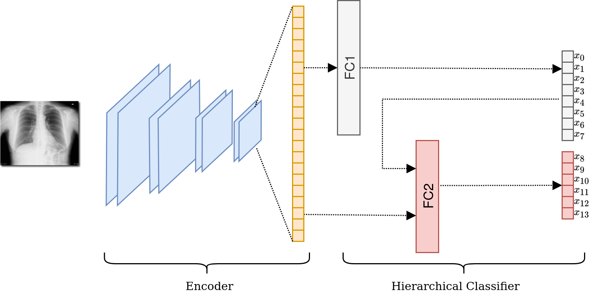

# CORSA - Lung Patterns Analysis

Source code for pretraining models on the CheXpert dataset, for lung patterns analaysis, with the setup described in [1].




To cite this work:

```bibtex
@inproceedings{barbano2022two,
  title={A Two-Step Radiologist-Like Approach for Covid-19 Computer-Aided Diagnosis from Chest X-Ray Images},
  author={Barbano, Carlo Alberto and Tartaglione, Enzo and Berzovini, Claudio and Calandri, Marco and Grangetto, Marco},
  booktitle={International Conference on Image Analysis and Processing},
  pages={173--184},
  year={2022},
  organization={Springer}
}

```

---
[1] Barbano, Carlo Alberto, et al. "A Two-Step Radiologist-Like Approach for Covid-19 Computer-Aided Diagnosis from Chest X-Ray Images." International Conference on Image Analysis and Processing. Springer, Cham, 2022.
